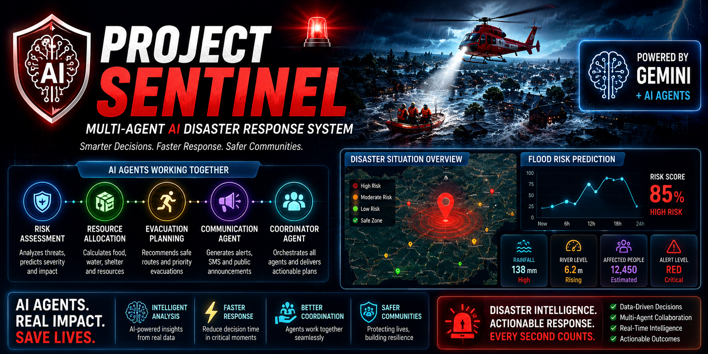
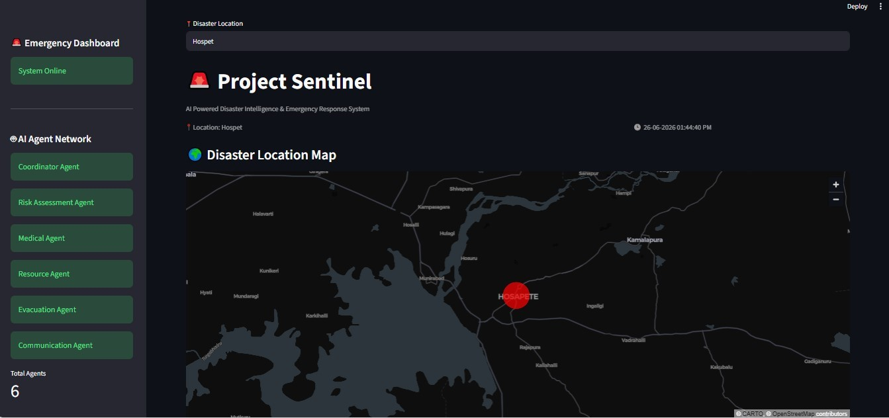
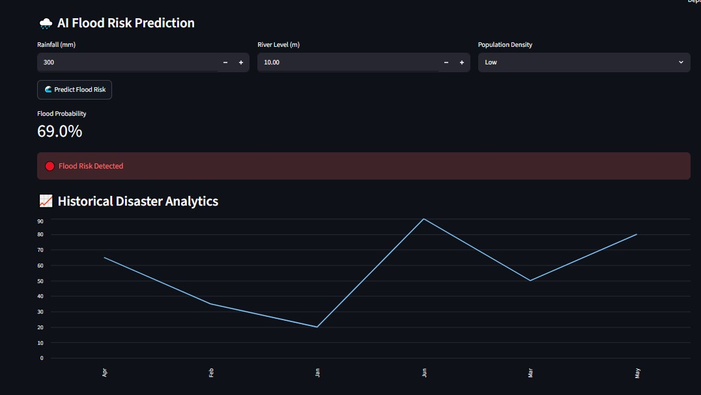
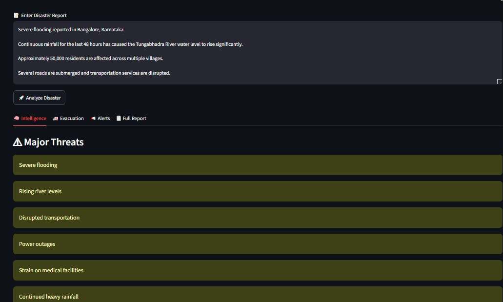
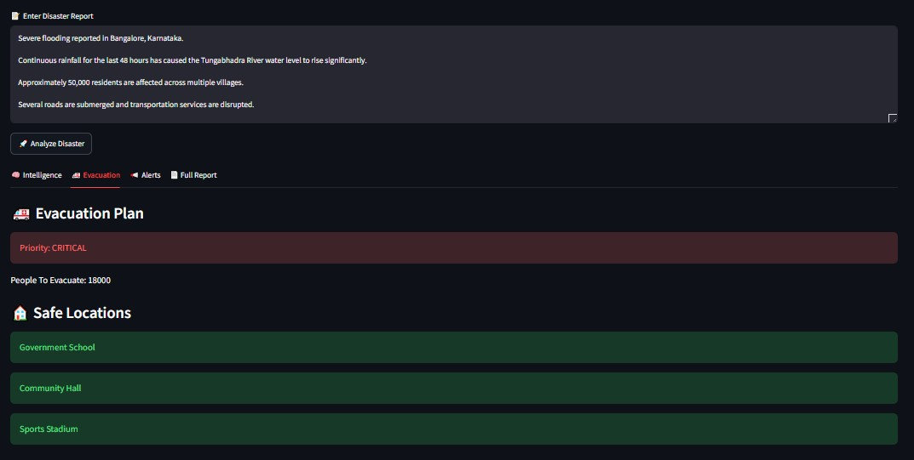
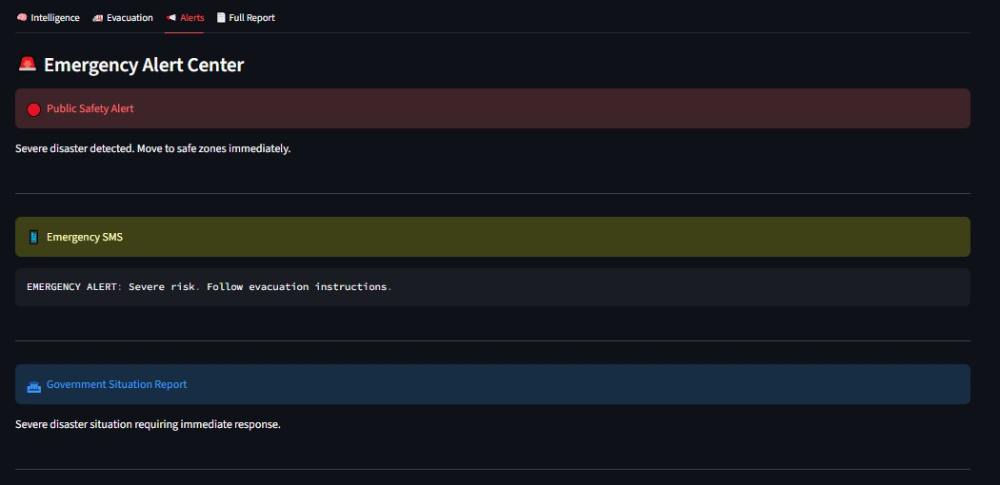
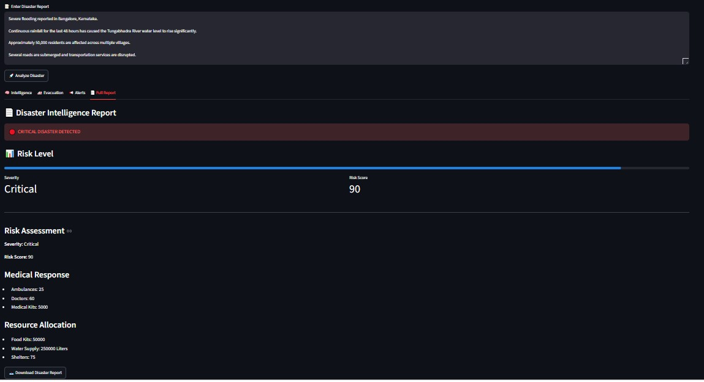

# 🚨 Project Sentinel



AI-Powered Disaster Intelligence & Emergency Response System

Project Sentinel is a multi-agent AI system that helps analyze disasters, assess risks, plan evacuations, allocate resources, and generate emergency alerts.

## 🌟 Features

- Multi-Agent Disaster Intelligence System
- AI-Based Disaster Report Analysis
- Flood Risk Prediction using Machine Learning
- Evacuation Planning Agent
- Emergency Communication Agent
- Resource Allocation Agent
- Interactive Streamlit Dashboard
- Downloadable Disaster Reports
- Location Mapping with PyDeck

Built as a Capstone Project for the Kaggle + Google 5-Day AI Agents Intensive Course.

## 📸 Dashboard Screenshots

### Main Dashboard



### Flood Prediction



### Intelligence Module



### Evacuation Planning



### Emergency Alerts



### Disaster Reports



## 🚀 How to Run

### 1. Clone Repository

```bash
git clone https://github.com/Tanmaicoder/Project-Sentinel.git
cd Project-Sentinel
```

### 2. Create Virtual Environment

```bash
python -m venv venv
```

### 3. Activate Virtual Environment

Windows:

```bash
venv\Scripts\activate
```

### 4. Install Dependencies

```bash
pip install -r requirements.txt
```

### 5. Create .env File

```env
GEMINI_API_KEY=YOUR_API_KEY
```

### 6. Train Flood Prediction Model

```bash
python ml/train_model.py
```

### 7. Run Application

```bash
streamlit run dashboard.py
```

Application will open at:

```text
http://localhost:8501
```


